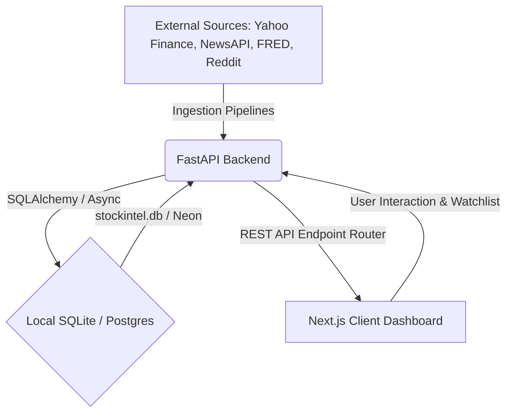

# StockIntel 📈🤖

StockIntel is a high-fidelity stock intelligence and decision-support platform designed to help retail traders, beginner investors, and researchers judge whether a stock is worth attention right now.

Unlike traditional tools that offer simple black-box price predictions or blind recommendations, **StockIntel is built entirely on explainability**. It ingests market data, SEC filings, financial news, macroeconomic indicators, and social sentiment, then parses them into multi-layered signal indexes to form clear, reason-based decision summaries.

---

## 🌟 Key Features

* **Reason-Based Decision Engine**: Evaluates stocks across multiple dimensions to output nuanced labels: `Strong Setup`, `Watchlist`, `Mixed Signals`, `High Risk`, or `Avoid`.
* **Multi-Layer Analysis**: Processes and scores individual signals independently:
  * **Sentiment**: Aggregated and parsed social/news trends.
  * **Fundamentals**: Key financial ratios and balance sheet strength.
  * **Technicals**: Key trendlines, moving averages, and momentum metrics.
  * **Risk & Confidence**: Visual risk profiles and signal certainty indicators.
* **Explainability Matrix**: Highlights the top positive and negative factors, structural theses, and "What Changed Today" daily diffs.
* **Dynamic Watchlist**: Save and monitor stocks of interest with historical score tracking.
* **Automated Data Pipeline**: Background ingestion powered by APScheduler pulls standard daily updates from trusted APIs.

---

## 🏗️ System Architecture



### Stack Components

* **Frontend**: Next.js (App Router), React 18, TypeScript, Tailwind CSS, Framer Motion (smooth animations), Recharts (data visualizations), and NextAuth.
* **Backend**: FastAPI, SQLAlchemy (Asynchronous execution via `aiosqlite`/`asyncpg`), Pydantic Settings, and APScheduler (orchestrated background workers).
* **Database**: Serverless PostgreSQL (Neon.tech) with local SQLite (`stockintel.db`) fallback for offline development.

---

## 📂 Project Directory Structure

```
StockIntel/
├── backend/                  # FastAPI Application
│   ├── api/                  # API endpoint controllers (routes)
│   ├── core/                 # App configurations, database connections, and scheduler
│   ├── models/               # SQLAlchemy ORM models
│   ├── ingestion/            # Scheduled scrapers and data ingestion routines
│   ├── scoring/              # Signal analysis and decision engine calculators
│   ├── main.py               # Application entry point
│   └── requirements.txt      # Backend Python dependencies
│
├── frontend/                 # Next.js Application
│   ├── app/                  # Pages, templates, and routing
│   ├── components/           # Reusable UI components & Recharts panels
│   ├── styles/               # CSS global styles & Tailwind config
│   ├── hooks/                # Custom React hooks (e.g., SWR data fetching)
│   ├── package.json          # Node project dependencies & scripts
│   └── ...
│
└── .gitignore                # Git ignore settings (ignores local databases like *.db)
```

---

## ⚙️ Configuration & Environment Setup

Both backend and frontend apps run with their own environment configurations. Copy the sample values into active `.env` files.

### 🐍 Backend Configuration (`/backend/.env`)
Create a `.env` file inside the `backend` directory:
```env
# API Keys (Fallback mock data will be generated if left empty)
NEWS_API_KEY=your_news_api_key
FRED_API_KEY=your_fred_api_key
ALPHA_VANTAGE_KEY=your_alpha_vantage_api_key

# Databases (Defaults to local SQLite stockintel.db if database URL is omitted)
NEON_DATABASE_URL="your_postgresql_neon_connection_string"
DATABASE_URL="your_postgresql_neon_connection_string"
```

### 🌐 Frontend Configuration (`/frontend/.env`)
Create a `.env` file inside the `frontend` directory:
```env
# NextAuth Session encryption key
NEXTAUTH_SECRET=your_super_secret_session_encryption_key
NEXTAUTH_URL=http://localhost:3000

# FastAPI Gateway Endpoint
NEXT_PUBLIC_API_URL=http://127.0.0.1:8000

# Neon Authentication (Optional if using database-auth providers)
NEXT_PUBLIC_NEON_AUTH_URL=your_neon_auth_url
```

---

## 🚀 Getting Started

Follow these steps to run the application locally.

### 1. Set Up the Backend
1. Navigate to the backend directory:
   ```bash
   cd backend
   ```
2. Create and activate a Python virtual environment:
   * **Windows**:
     ```bash
     python -m venv venv
     .\venv\Scripts\activate
     ```
   * **macOS/Linux**:
     ```bash
     python3 -m venv venv
     source venv/bin/activate
     ```
3. Install the required dependencies:
   ```bash
   pip install -r requirements.txt
   ```
4. Start the FastAPI development server:
   ```bash
   uvicorn main:app --reload --port 8000
   ```
   *The backend will boot up and automatically initialize the database schemas.*

---

### 2. Set Up the Frontend
1. Open a new terminal and navigate to the frontend directory:
   ```bash
   cd frontend
   ```
2. Install the Node packages:
   ```bash
   npm install
   ```
3. Run the Next.js development server:
   ```bash
   npm run dev
   ```
4. Open [http://localhost:3000](http://localhost:3000) in your web browser to view the application.

---

## 🛠️ Data Pipeline Ingestion

The platform schedules ingestion routines to update metrics daily:
* **Market Updates**: Fetched from Yahoo Finance APIs.
* **News & Economic Data**: Ingested via NewsAPI and FRED endpoints.
* **Scoring Calculation**: Daily calculations evaluate sentiment drift, technical moving averages, and fundamental balance sheet health, saving the metrics to the active database.
